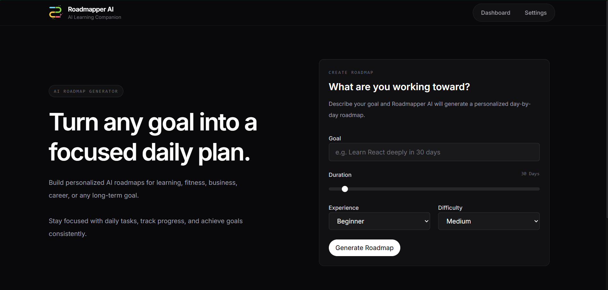
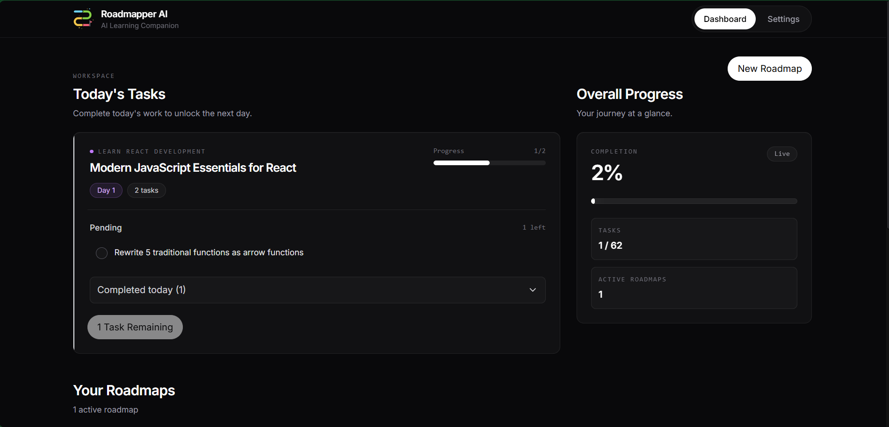
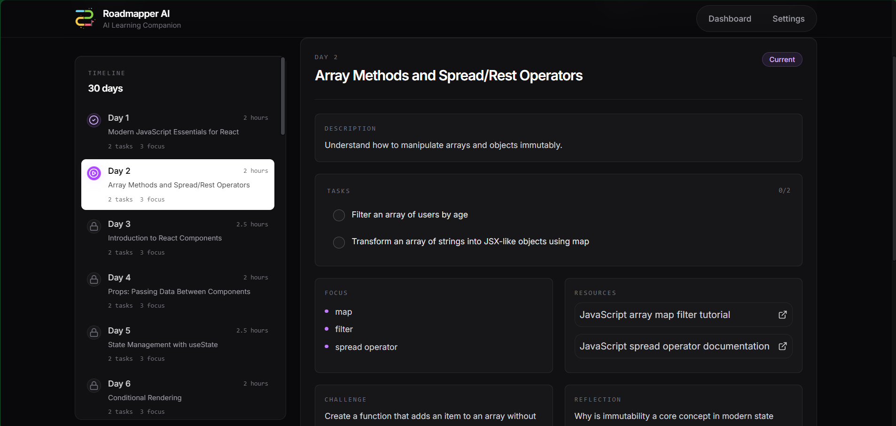
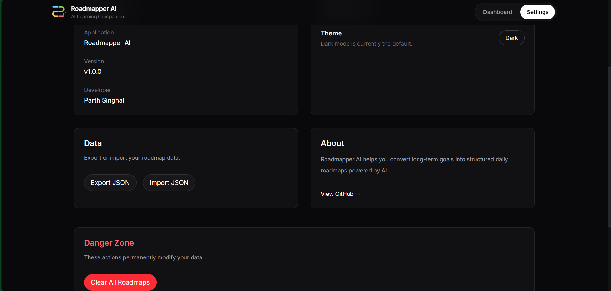

# Roadmapper AI

> AI-powered personalized learning roadmaps with daily progress tracking.

Roadmapper AI helps you transform ambitious goals into structured, day-by-day learning plans. Simply describe your goal, choose your experience level, preferred duration, and difficulty, and let AI generate a personalized roadmap that you can actually follow.

Instead of overwhelming you with everything at once, Roadmapper AI focuses on one day at a time—helping you stay consistent until you achieve your goal.

---

## Live Demo

**Application:** https://road-mapper-ai.vercel.app/

---

## Preview

| Home                            | Dashboard                                 |
| ------------------------------- | ----------------------------------------- |
|  |  |

| Roadmap                               | Settings                                |
| ------------------------------------- | --------------------------------------- |
|  |  |

---

# Features

* AI-generated personalized learning roadmaps
* Multiple active roadmaps
* Day-by-day learning timeline
* Daily task management
* Progress tracking
* Overall dashboard analytics
* Daily notes
* Learning resources
* Archive & restore roadmaps
* Responsive design
* Premium dark UI
* Local-first storage (no account required)

---

# Tech Stack

| Category   | Technology            |
| ---------- | --------------------- |
| Frontend   | React, Vite           |
| Styling    | Tailwind CSS          |
| Animations | Framer Motion         |
| Routing    | React Router          |
| Icons      | Lucide React          |
| AI         | Google Gemini API     |
| Storage    | Browser Local Storage |

---

# Project Structure

```text
src
│
├── assets/
├── components/
│   ├── dashboard/
│   ├── layout/
│   ├── roadmap/
│   └── ui/
│
├── pages/
├── services/
├── utils/
│
├── App.jsx
└── main.jsx
```

---

# Getting Started

## Clone the repository

```bash
git clone https://github.com/your-username/roadmapper-ai.git
```

## Move into the project

```bash
cd roadmapper-ai
```

## Install dependencies

```bash
npm install
```

## Create environment variables

Create a `.env` file in the project root.

```env
VITE_GEMINI_API_KEY=your_api_key
```

## Run locally

```bash
npm run dev
```

## Production build

```bash
npm run build
```

## Preview production build

```bash
npm run preview
```

---

# How It Works

```text
Goal
   │
   ▼
Choose Duration
Choose Experience
Choose Difficulty
   │
   ▼
Google Gemini AI
   │
   ▼
Personalized Roadmap
   │
   ▼
Daily Tasks
   │
   ▼
Track Progress
   │
   ▼
Complete Goal
```

---

# Design Philosophy

Roadmapper AI follows a minimal product design language inspired by modern software such as Vercel, Linear and v0.

The interface prioritizes:

* Clean typography
* Spacious layouts
* Minimal distractions
* Smooth animations
* Clear visual hierarchy
* Consistent spacing
* Dark-first design

The objective is to keep users focused on learning instead of managing complicated interfaces.

---

# Future Improvements

* Cloud synchronization
* Cross-device access
* AI roadmap refinement
* Calendar integration
* Daily reminders
* Habit streaks
* Progress analytics
* Shareable roadmaps
* Community roadmap templates
* PDF export
* Mobile application

---

# Why I Built This

Most people know **what** they want to achieve but struggle with **how** to approach it.

Searching for tutorials, deciding what comes next, and building a structured learning path often takes longer than learning itself.

Roadmapper AI removes that friction by generating practical AI-powered learning roadmaps and helping users stay consistent with daily progress tracking.

---

# Contributing

Contributions, suggestions, and feedback are always welcome.

If you'd like to improve Roadmapper AI, feel free to open an issue or submit a pull request.

---

# Author

**Parth Singhal**

GitHub: https://github.com/PLYRparth
LinkedIn: https://www.linkedin.com/in/parth-singhal-92b1b1313/

---

# License

This project is licensed under the MIT License.
